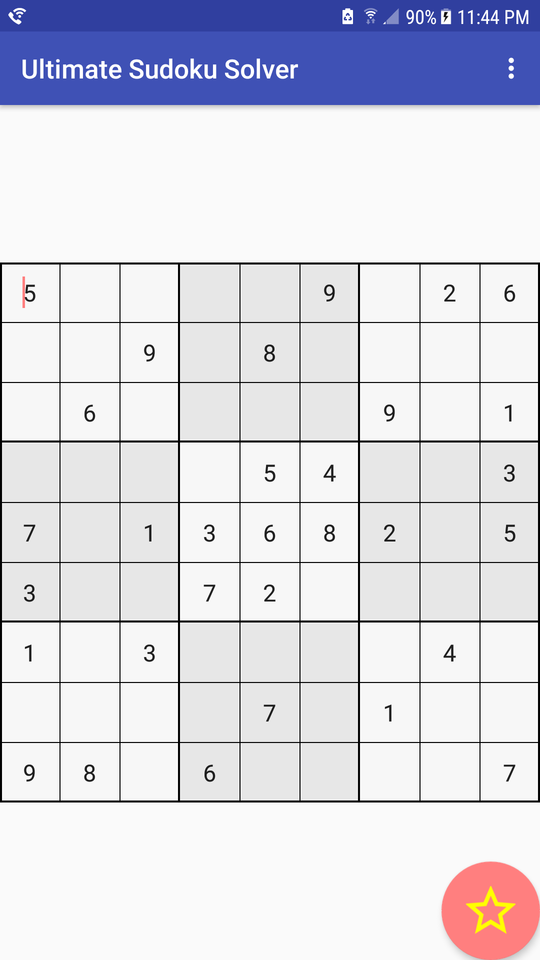
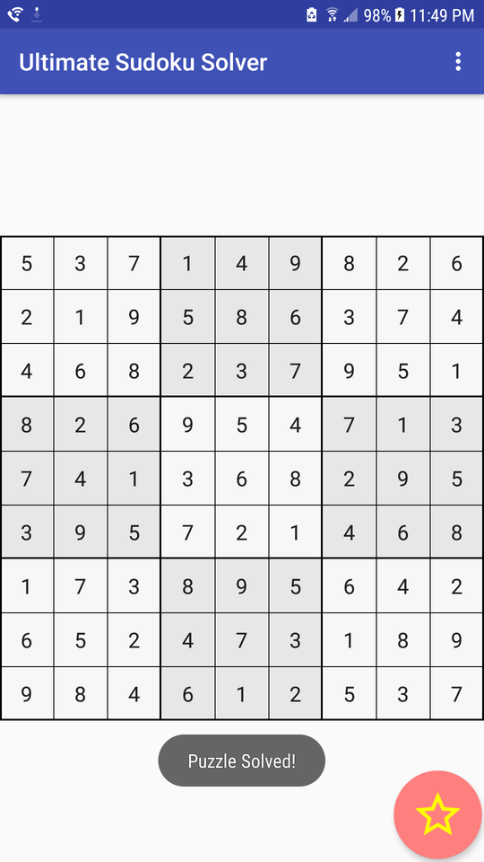
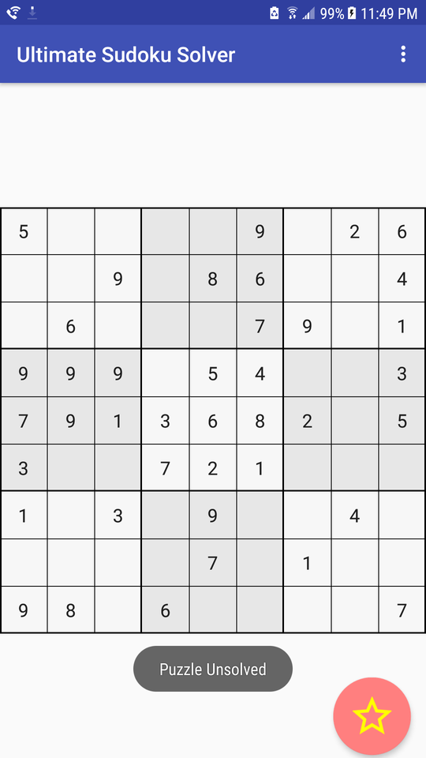
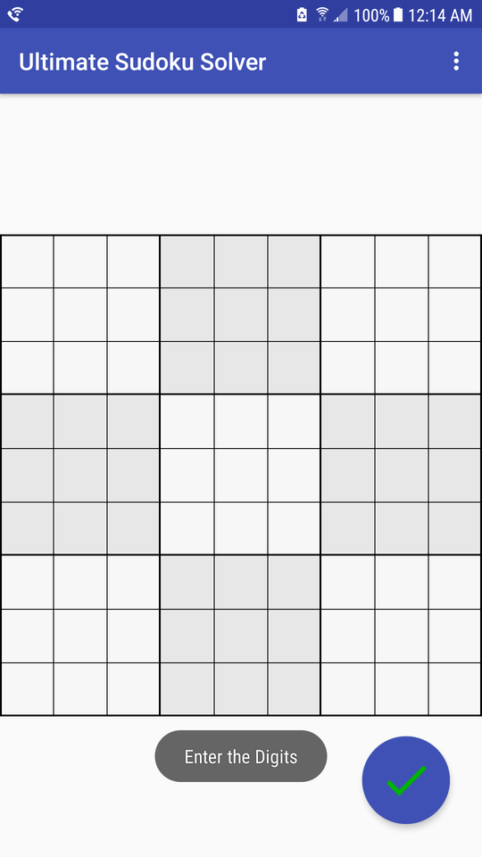

# Ultimate-Sudoku-Solver
### Sudoku Puzzle Game and Solver

New to Sudoku. Find out!

https://en.wikipedia.org/wiki/Sudoku

https://www.youtube.com/watch?v=XI6_VhPFjCQ

## Game
New puzzle

### Solve and Confirm Solution
Click on the _star_ button

### Made a mistake?

Click on the _star_ button

### Start over
Click from the action bar 'Reset Puzzle'

### Make a new Puzzle
Fork this Repo to include your own generator
- Click 'New Puzzle'
- Click on the _check mark_ button when finsihed setting up
- Play or solve, as usual

## Solver
Solves Sudoku Puzzles using a search to make all possible deductions. When the state becomes such that no more logical deductions are possible, the solver is finished.
The solver is stable; it "solves" puzzles in the following states:
- Not completed
- Completed
- Inconsistent

### Not completed
No formal definition apart from neither _Completed_ nor _Inconsistent_. Informally, if the puzzle has enough information, and it is not inconsistent, it will be solved

### Completed
The puzzle has already been completed, in which case the solver makes the quick determination 'already finished'. If the puzzle is not inconsistent, the solver will report _Success_

### Inconsistent
The puzzle was incorrectly entered or a false deduction was made external to the solver. The solver will report _Failed_

## Algorithm

### Divide and Conquer

Search for a smaller _partition_ within a parent _partition_. Two smaller _partitions_ are formed.

_Partition_, Defined:
>A partition is a subset of cells that contain digit possibilities that number in size equal to the number of cells

_Deduction_, Defined:
>The event of forming or discovering two partitions whose union is a partition already contained in the puzzle 

The algorithm is finished when all partitions are of size 1, a cell with a single digit, or all deductions have been exhausted

### Code Snippets _Java_

    public SudokuPuzzleSolution solve(int[][] puzzle) {
            initializePuzzle(puzzle);
            makeInitialDeductions();
            boolean isSolved;
    
            try {
                makeGeneralDeductions();
                isSolved = isSolved();
            } catch (Exception e) {
                Log.e("Solver", e.getMessage());
                // The solver had an internal error
                isSolved = false;
            }
            return new SudokuPuzzleSolution(isSolved, copyPartiallySolvedPuzzle());
        }
        
1) Place all cells into partitions

        makeInitialDeductions();
        
2) Make all deductions

    Failure by Exception implies an internal error with the solver
         
        try {
            makeGeneralDeductions();
            
3) Return the condition of whether the puzzle was solved successfully

    Check all partitions are of size 1 -each cell contains a single digit

         try {
             //..
             isSolved = isSolved();     
         }